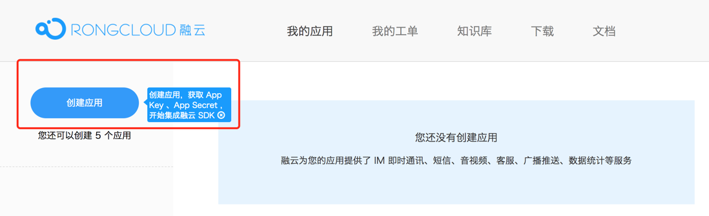
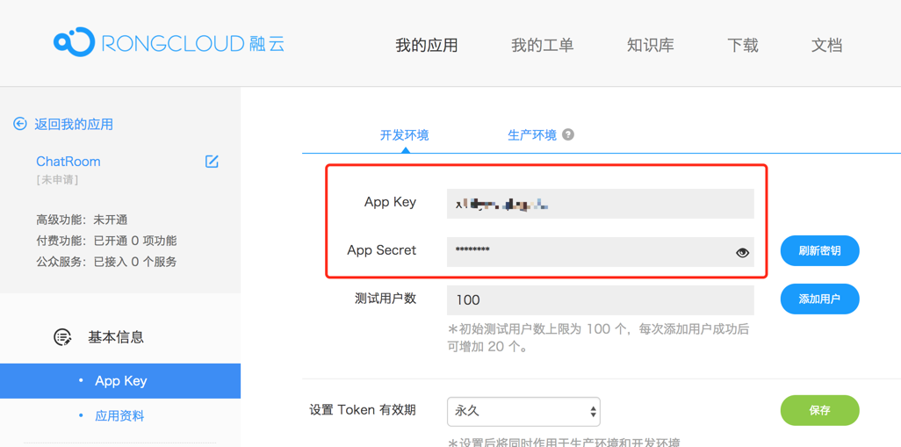

#### 快速开始

##### 1、注册开发者，请移步 [开发者后台](https://developer.rongcloud.cn)

##### 2、创建应用

##### 3、获取 Appkey 、 Secret

##### 4、Server SDK 使用方法，请参考如下示例:

String appKey = "e0x9wycfx7flq";
String appSecret = "STCevzDS6Xy18n";
RongCloud rongCloud = RongCloud.getInstance(appKey, appSecret);
UserModel user = new UserModel()
        .setId("userId1")
        .setName("username")
        .setPortraitUri("http://www.rongcloud.cn/images/logo.png");
TokenResult result = rongCloud.User.refresh(user);



/**
	1、安装 Node，请移步 Node 官网 https://nodejs.org 支持的最低为 0.12.18+
	2、npm install rongcloud-sdk
	3、参看以下 User 模块示例（用户注册）
*/

var RongCloud = require('rongcloud-sdk');
// 移步开发者后台获取：https://developer.rongcloud.cn
var appkey = '8alwspkvucoim', 
	secret = 'yaicmsjl0a3LWz';

// 获取 SDK 实例
var Rong = RongCloud({
	appkey: appkey,
	secret: secret
});

// 以注册用户为例
var User = Rong.User;
var user = {
	id: 'mnktiytan0',
	name: 'Martin',
	portrait: 'http://oojs2ztoq.bkt.clouddn.com/faf20fae77e2e0bdafd7c148e6193418.jpg'
};
User.register(user).then(result => {
	console.log(result);
}, error => { 
	console.log(error);
});
